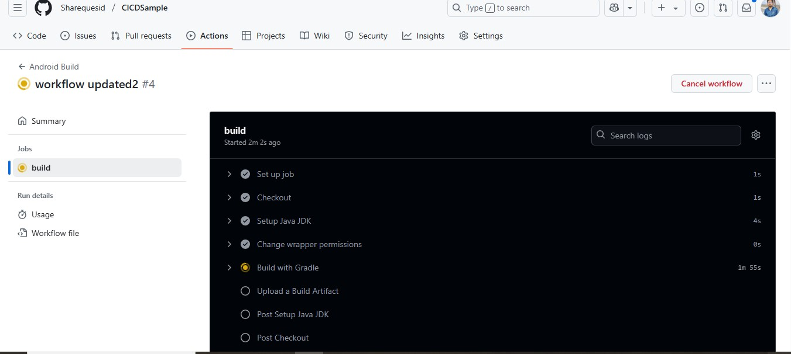
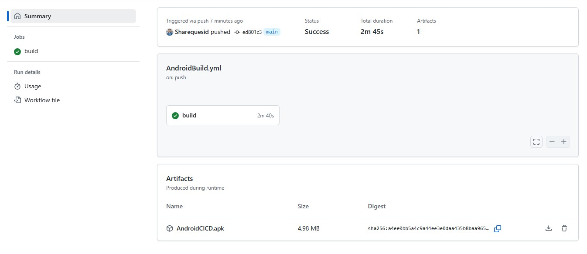
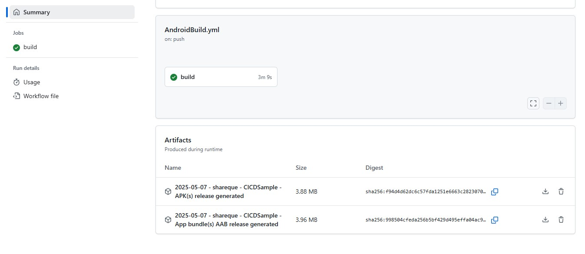

# CI/CD Sample app is for creating ci/cd for building artifacts
- This sample code is only for demo purpose i will only create a build not to publish on any store.
- publishing on play store is require some setup in play store account so i will skip this step.

#
- CI- running unit test and creating build 
- CD- Deploy app on maven or play store.


- Checkout
- Set up JDK 
- Build with Gradle
- Run Unit tests(Optional)
- Build Release Bundle(AAB)
- Sign Bundle
- Upload Bundle(Optional)
- Prepare Play Store Service Account
- Deploy to Play Store
- Notify Build status on Slack(Optional)

## Steps are used to create yaml file for creating and uploading apk/aab file.For sample code please see AndroidBuild.yml file and steps in comment.
# 1. Checkout
- This action checks-out your repository under $GITHUB_WORKSPACE so your workflow can access it.
```yaml
- name: Checkout
  uses: actions/checkout@v2
```

# 2. Set up JDK
- Here, the goal is simple. To set up a JDK version to Java Version.
```yaml
- name: Setup Java JDK
  uses: actions/setup-java@v4.0.0
  with:
    java-version: '17'
    distribution: 'adopt'
```

# 3. Build with Gradle
- Build your app with Gradle. It is the same command you use in your terminal to build the project.
```yaml
- name: Build with Gradle
  id: build
  run: ./gradlew build
```

# 4. Run Unit tests (Optional)
- It runs unit tests located in the project. You can skip this step if you have not written any tests.
```yaml
- name: Unit tests
  id: tests
  run: ./gradlew test
```

# 5. Build Release Bundle(AAB)
- Time to build your release bundle. You can also build APK with assembleRelease command if you want. But I prefer bundle to optimize app size.
```yaml
- name: Build Release AAB
  id: buildRelease
  run: ./gradlew bundleRelease
```


# 6. Sign Bundle
- To use these keys from the workflow, we’ll add it to GitHub Secrets. So it’ll not be exposed.
- To add Secrets, open your repository and go to Settings.
- Now click on Secrets and variables from left panel-> Actions -> in secret tab - Repository secrets-> create
- Add the following Secrets in your repository

* SIGNING_KEY — base64 text of your Keystore file
* ALIAS — your alias name
* KEY_STORE_PASSWORD — password of your Keystore
* KEY_PASSWORD — your key password

```yaml
- name: Sign AAB
  id: sign
  uses: r0adkll/sign-android-release@v1
  # r0adkll/sign-android-release@v1 used for creating signed build.
  with:
    releaseDirectory: app/build/outputs/bundle/release
    signingKeyBase64: ${{ secrets.SIGNING_KEY }}
    alias: ${{ secrets.ALIAS }}
    keyStorePassword: ${{ secrets.KEY_STORE_PASSWORD }}
    keyPassword: ${{ secrets.KEY_PASSWORD }}
    env:
        # Setting build tool version will reduce error if we comment this line it will through exception for build tool version 29.*
        BUILD_TOOLS_VERSION: "34.0.0"
```

# 7. Upload Bundle(Optional)
- This step is also optional. it is not needed until you need to download that build.
```yaml
- name: Upload AAB
  id: uploadArtifact
  uses: actions/upload-artifact@v4
  with:
      name: app
      path: app/build/outputs/bundle/release/app-release.aab
```

<p align="center">


  
    
</p>